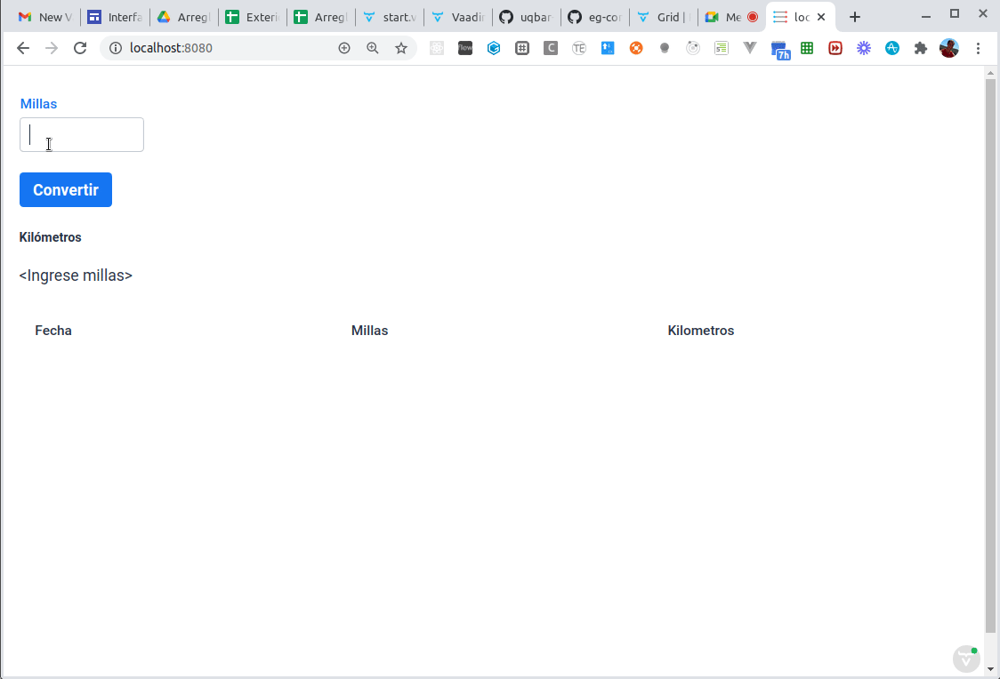
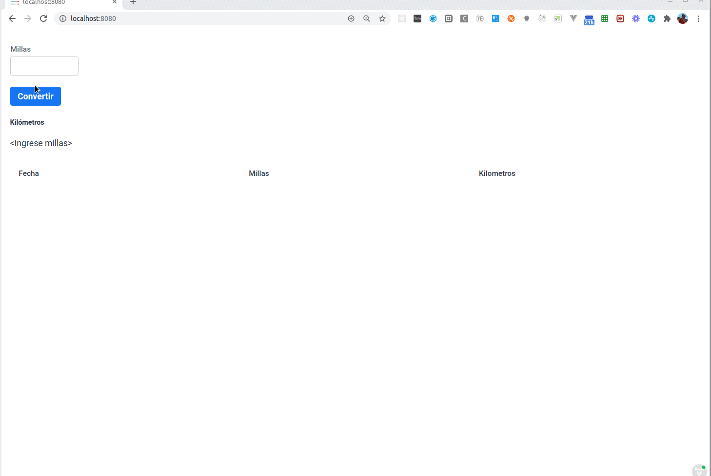
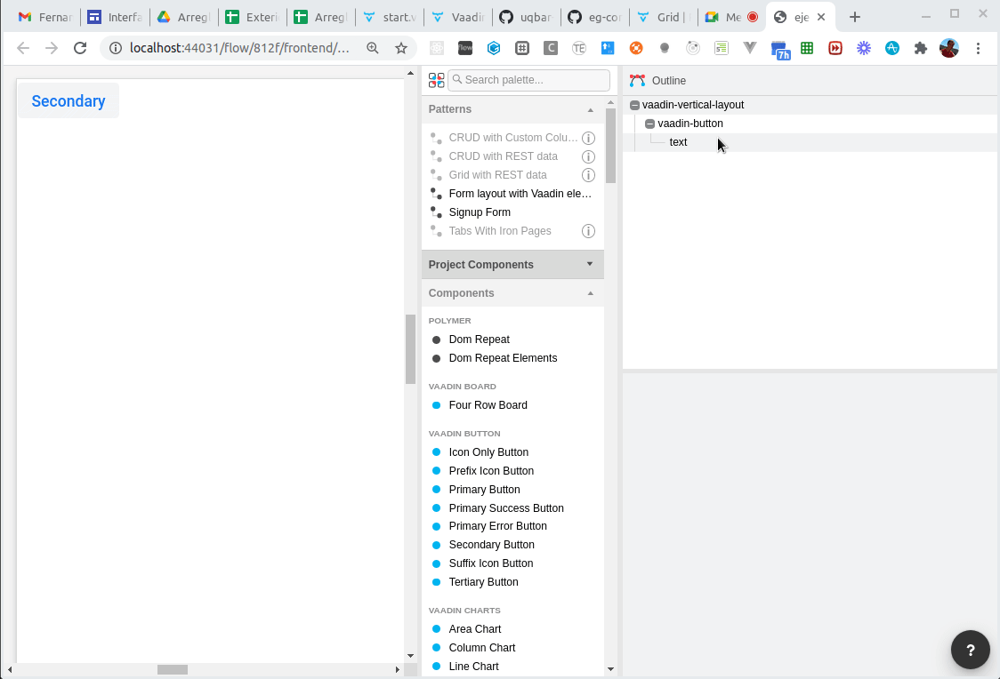
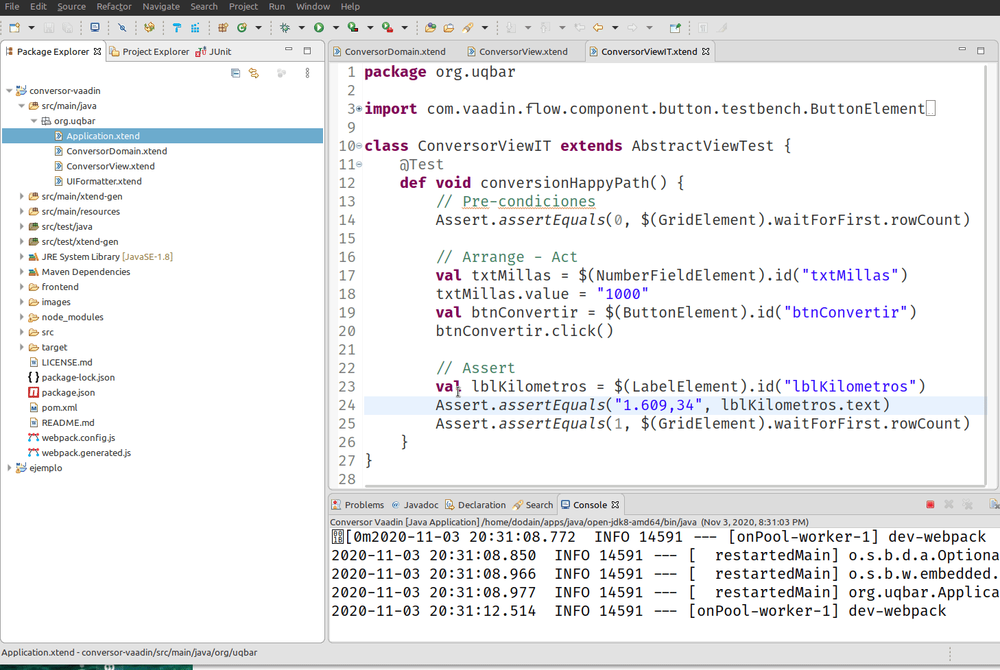

# Conversor en Vaadin



En este ejemplo mostramos el típico ejemplo del conversor en el framework Vaadin, donde

- el usuario puede ingresar millas
- con el botón Convertir se convierte a kilómetros y se muestra en un label
- adicionalmente tenemos una grilla que muestra el historial de conversiones que fuimos haciendo

## Cómo es Vaadin

Vaadin integra componentes UI que tienen

- una parte cliente (en Javascript)
- y una contraparte server (que corre en una JDK, en nuestro caso en programada en Xtend)


## Estructura general del proyecto

El proyecto tiene la siguiente [estructura](https://maven.apache.org/guides/introduction/introduction-to-the-standard-directory-layout.html):
- `src/main/java`: están los fuentes de la aplicación
   - `Application.java` es el punto de entrada de la aplicación Java que levanta Springboot y las rutas de acceso al servidor web
   - `MainView.java` es el nombre de la vista a la que apunta por defecto, pero nosotros creamos
   - `ConversorView.xtend` que es el container donde definimos nuestro conversor
- En `src/test/java` se ubican los archivos de tests
- `src/main/resources` contiene archivos de configuración y assets (íconos, imágenes, etc.)
- la carpeta `frontend` en la raíz tiene las dependencias del lado del cliente, en particular
   - `frontend/styles`: tiene los archivos css
   - `frontend/src`: aquí están los **templates**, las vistas construidas con el DSL de Vaadin del lado del cliente (las que se arman a mano o con la herramienta Designer, como pueden ver más abajo)

## Desarrollando del lado de Java

### Annotations

En el ejemplo del conversor, podemos ver la definición que hicimos del lado de Java. Comencemos por las _annotations_:

```java
@Route("")
@PWA(name="Conversor Vaadin", shortName="Conversor", description="El viejo y confiable conversor", enableInstallPrompt=false)
@CssImport("./styles/shared-styles.css")
@CssImport(value="./styles/vaadin-text-field-styles.css", themeFor="vaadin-text-field")
```

- la ruta `""` nos permite asociarla al raíz de nuestro proyecto, por eso `http://localhost:8080` levanta este componente. Si lo definimos como `@Route("/conversor")` entonces tendremos que usar la URL `http://localhost:8080/conversor`
- `@PWA` nos permite configurarlo para diferentes dispositivos como una [progressive web application](https://web.dev/progressive-web-apps/), fuera del alcance del presente tutorial
- luego agregamos los imports a los archivos de estilos necesarios para Vaadin

### Container principal: uso de componentes de UI

Vaadin trae una serie de componentes útiles para definir nuestro conversor, veamos por ejemplo cómo definir el container principal y el input que permite ingresar las millas:

```xtend
class ConversorView extends VerticalLayout {
  val conversor = new ConversorDomain

  new() {
    val txtMillas = new NumberField("Millas") => [
      addThemeName("bordered")
      width = "250"
      id = "txtMillas"
    ]
```

La sintaxis con Java es un poco más verbosa pero la idea es muy similar:

- `ConversorView` tiene por defecto un layout vertical, lo que se refleja con una relación de **herencia** (podría haber sido más interesante modelar un Container que a su vez tuviera un layout)
- la vista tiene un dominio, pero el binding de Vaadin es bastante más limitado que el de otros frameworks como Angular (o Arena si lo pudiste conocer)
- el componente de UI `NumberField` se sincroniza con una versión javascript, lo que permite establecer un ida y vuelta entre cliente y servidor que es "casi" transparente. Lo vemos en la solapa Network, donde se manda el json con la información de la vista cada vez que se renderiza nuevamente:



### Eventos de usuario

Cuando el usuario dispara la conversión el listener recibe la notificación, lo que actualiza tanto el label como la grilla:

```xtend
val btnConvertir = new Button("Convertir") => [
   id = "btnConvertir"
   addClickListener([ e | 
      conversor.millas = txtMillas.value
      conversor.convertir
      lblKilometros.text = conversor.kilometrosAsString
      grdConversiones.getDataProvider().refreshAll
   ])
   addThemeVariants(ButtonVariant.LUMO_PRIMARY)
   addClickShortcut(Key.ENTER)
]
```

El lector puede ver cómo se implementa el resto de la página.

### Desarrollando con el Designer de Vaadin (versión Pro)

Si bien ésta es una característica de la versión profesional (paga) de Vaadin, se puede ver una pequeña demo:



La vista se puede definir

- con un DSL (un lenguaje para construir vistas propio de Vaadin)
- o bien visualmente utilizando la herramienta Designer

Para más información pueden ver [esta página](https://vaadin.com/designer)

## Cómo se ejecuta la aplicación

Desde la consola podés ejecutar el comando maven:

```bash
mvn spring-boot:run
```

O bien desde Eclipse, ejecutando el main que está en la clase `Application`.

En cualquiera de los dos casos, el servidor que levanta es SpringBoot (se puede configurar un Jetty si están interesados en tener una versión más liviana).

## Testeos de integración con Selenium

Los tests de integración se implementan con [Vaadin TestBench](https://vaadin.com/testbench). Para ejecutar los tests con Google Chrome está el siguiente goal de Maven:

```bash
mvn verify -Pit,production
```

Desde el Eclipse, se pueden ejecutar los tests con Selenium, que levanta el navegador y simula el pantalleo como vemos a continuación:



El lector puede ver el test de integración que generamos para este ejemplo.

## Links relacionados

- Vaadin Basics [https://vaadin.com/docs](https://vaadin.com/docs)
- More components at [https://vaadin.com/components](https://vaadin.com/components) and [https://vaadin.com/directory](https://vaadin.com/directory)
- Download this and other examples at [https://vaadin.com/start](https://vaadin.com/start)
- Using Vaadin and Spring [https://vaadin.com/docs/v14/flow/spring/tutorial-spring-basic.html](https://vaadin.com/docs/v14/flow/spring/tutorial-spring-basic.html) article
- Join discussion and ask a question at [https://vaadin.com/forum](https://vaadin.com/forum)
